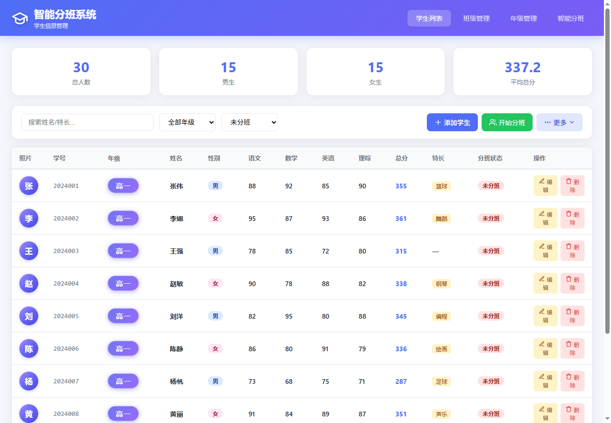
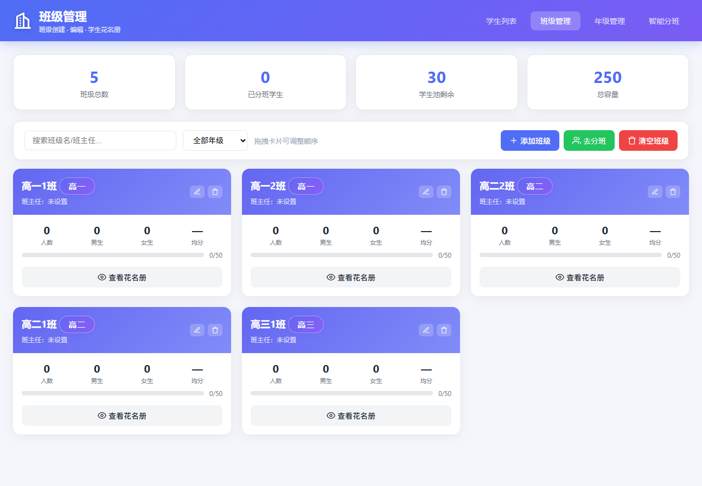
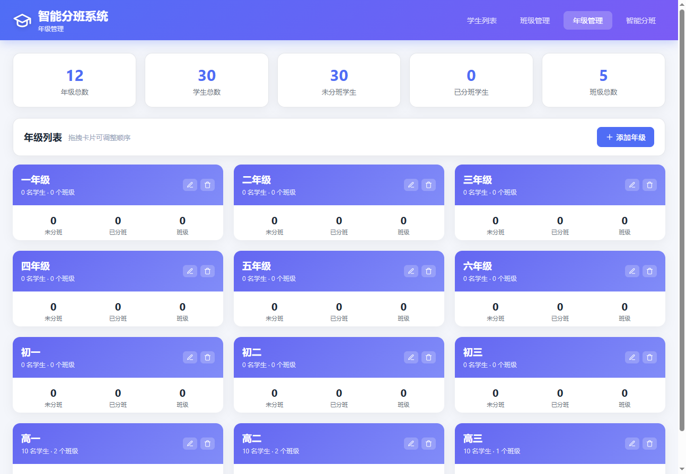
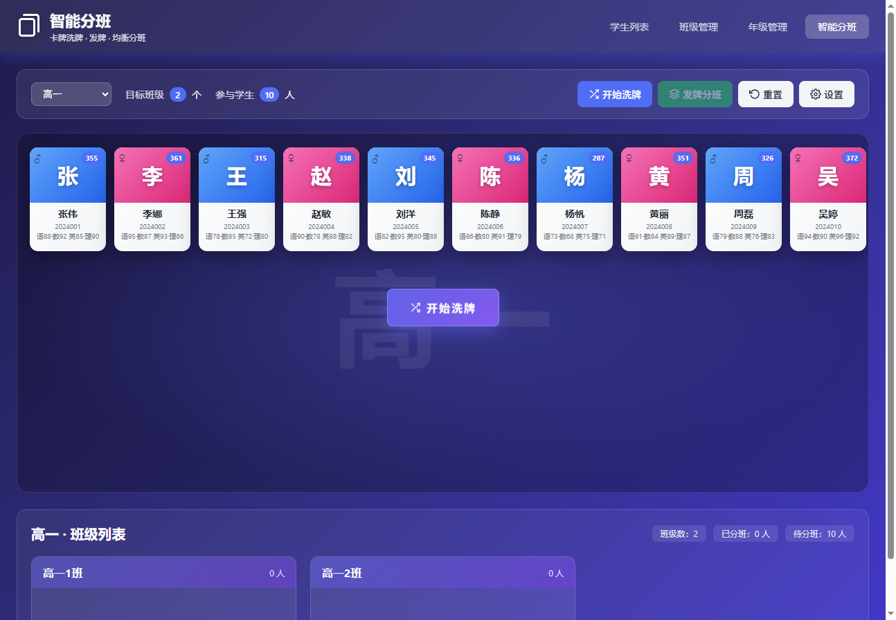

# 智能分班系统

一个基于纯 Node.js（零依赖）的智能分班系统，提供学生信息管理、班级/年级管理与卡牌洗牌发牌式的智能分班动画效果。

## 界面预览

**学生列表** — 统计卡片、搜索筛选、分页、学生表格



**班级管理** — 班级卡片、容量与花名册



**年级管理** — 年级卡片、拖拽排序



**智能分班** — 卡牌洗牌发牌动画



## 功能特性

### 学生列表（index.html）
- 学生信息统计：总人数、男生/女生数、平均总分
- 按姓名/学号/特长搜索，按年级、分班状态筛选
- 分页浏览（10/20/50/100 条每页，设置自动持久化）
- 添加/编辑/删除学生，批量导入示例数据
- **下载示例表格**：导出 CSV 模板（UTF-8 BOM，Excel 打开不乱码）
- **导入表格数据**：按表头名解析 CSV 文件批量导入，跳过姓名为空的行并提示行号

### 班级管理（classes.html）
- 班级的新增、编辑、删除（删除后学生自动退回学生池）
- 班级卡片拖拽排序，顺序持久化（搜索/筛选时自动禁用排序）

### 年级管理（grades.html）
- 年级的新增、重命名、删除，拖拽排序
- 重命名/删除年级会同步更新学生与班级数据
- 年级排序影响智能分班页的年级下拉顺序

### 智能分班（allocate.html）
- 卡牌洗牌 + 发牌动画：学生卡牌先放大展示（1.1–2.5 倍可调），再飞入对应班级
- 动画速度 1–5 档可调，设置持久化
- 分班前必须选择年级；洗牌/分班过程中按钮自动隐藏
- 分班结果一键提交持久化

## 快速开始

```bash
# 方式一
node server.js

# 方式二
npm start

# 方式三（Windows）
双击 运行.bat
```

浏览器访问 <http://localhost:3000>

> 修改 `server.js` 后需重启服务；修改 `public/` 下的前端文件刷新页面即可生效（静态资源已禁用缓存）。

## 项目结构

```
├── server.js              # HTTP 服务：API 路由 + 静态文件托管
├── package.json
├── 运行.bat               # Windows 一键启动脚本
├── data/                  # JSON 数据存储（自动创建）
│   ├── students.json      # 未分班学生
│   ├── classes.json       # 班级（含已分班学生）
│   ├── grades.json        # 年级列表
│   └── filters.json       # 前端筛选/设置持久化
├── docs/screenshots/      # README 界面截图
└── public/
    ├── index.html         # 学生列表页
    ├── classes.html       # 班级管理页
    ├── grades.html        # 年级管理页
    ├── allocate.html      # 智能分班页
    ├── css/style.css      # 全局样式
    └── js/
        ├── app.js         # 学生列表逻辑
        ├── classes.js     # 班级管理逻辑
        ├── grades.js      # 年级管理逻辑
        └── allocate.js    # 智能分班逻辑
```

## API 一览

| 方法 | 路径 | 说明 |
|---|---|---|
| GET | `/api/students` | 获取未分班学生 |
| GET | `/api/all-students` | 获取全部学生（含已分班，标记分班状态） |
| POST | `/api/students` | 新增学生 |
| PUT/DELETE | `/api/students/:id` | 更新/删除学生 |
| POST | `/api/students/batch` | 批量导入学生（数组） |
| DELETE | `/api/students` | 清空学生 |
| GET/POST | `/api/classes` | 获取/新增班级 |
| PUT | `/api/classes/order` | 班级拖拽排序持久化 |
| PUT/DELETE | `/api/classes/:id` | 更新班级/删除班级（学生退回池） |
| POST | `/api/classes/:id/remove/:stuId` | 单个学生退回学生池 |
| GET/POST | `/api/grades` | 获取/新增年级 |
| PUT | `/api/grades/order` | 年级拖拽排序持久化 |
| PUT/DELETE | `/api/grades/:name` | 重命名/删除年级 |
| POST | `/api/allocate` | 提交分班结果 |
| GET/PUT | `/api/filters` | 前端筛选与设置持久化 |

## CSV 导入格式

点击「更多 → 下载示例表格」获取模板，表头如下（列顺序无关，`姓名` 必填）：

```csv
学号,年级,姓名,性别,语文,数学,英语,理综,特长
2024001,高一,张伟,男,88,92,85,90,篮球
```

- 性别非「女」时默认按「男」处理
- 成绩列为空或非数字时按 0 处理
- 姓名为空的行会被跳过，导入完成后提示跳过的行号

## 使用注意事项

- 智能分班前必须先选择年级
- 洗牌/分班进行中时操作按钮会自动隐藏
- 搜索或筛选生效时，班级/年级卡片拖拽排序自动禁用，以保证全局顺序正确
